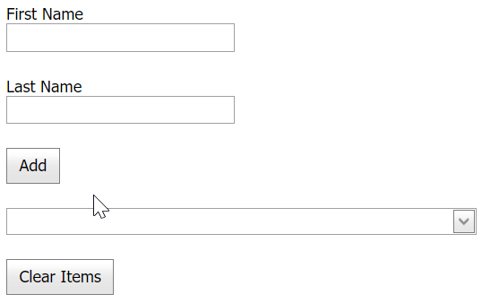

# Combo Box for ASP.NET Web Forms - How to add items to an editor on the client in multi-column mode
<!-- run online -->
**[[Run Online]](https://codecentral.devexpress.com/e1332/)**
<!-- run online end -->

This example demonstrates how to create a multi-column combo box editor and populate it with items on the client.



## Overview

Create a [combo box](https://docs.devexpress.com/AspNet/DevExpress.Web.ASPxComboBox#multi-column-mode) editor and populate it with columns.

```aspx
<dx:ASPxComboBox ID="ASPxComboBox1" runat="server" 
    ClientInstanceName="comboBox" ValueType="System.String" Width="350px" TextFormatString="{0} {1}">
    <Columns>
        <dx:ListBoxColumn Caption="First Name" Name="First Name" ToolTip="First Name" />
        <dx:ListBoxColumn Caption="Last Name" Name="Last Name" ToolTip="Last Name" />
    </Columns>
</dx:ASPxComboBox>
```

Add a text editor and a button to the page. In the button's client-side `Click` event handler, call the combo box editor's [AddItems](https://docs.devexpress.com/AspNet/js-ASPxClientComboBox.AddItem(text)) method to add an item to the editor's item collection based on the text editor's value. To remove all items from the collection, call the editor's [ClearItems](https://docs.devexpress.com/AspNet/js-ASPxClientComboBox.ClearItems) method.

```aspx
<dx:ASPxTextBox ID="ASPxTextBox1" runat="server" ClientInstanceName="firstName" Width="170px" />
<dx:ASPxTextBox ID="ASPxTextBox2" runat="server" ClientInstanceName="lastName" Width="170px" />
<dx:ASPxButton ID="ASPxButton2" runat="server" Text="Add " AutoPostBack="False">
    <ClientSideEvents Click="function(s, e) {
	    var fName=firstName.GetValue();
	    var lName=lastName.GetValue();
	    firstName.SetText('');
	    lastName.SetText(''); 
        var FullName = new Array(fName,lName);	
	    comboBox.AddItem(FullName);
    }" />
</dx:ASPxButton>
<dx:ASPxButton ID="ASPxButton1" runat="server" Text="Clear Items" AutoPostBack="False">
    <ClientSideEvents Click="function(s, e) {
	    comboBox.ClearItems();
    }" />
</dx:ASPxButton>
```

## Files to Review

* [Default.aspx](./CS/WebSite/Default.aspx) (VB: [Default.aspx](./VB/WebSite/Default.aspx))

## Documentation

* [Multi-Column Mode](https://docs.devexpress.com/AspNet/DevExpress.Web.ASPxComboBox#multi-column-mode)
